# Architecture Documentation

## Table of Contents
1. [System Overview](#system-overview)
2. [High-Level Architecture](#high-level-architecture)
3. [Database Architecture](#database-architecture)
4. [Authentication Flow](#authentication-flow)
5. [Application Flow](#application-flow)
6. [Component Architecture](#component-architecture)
7. [API Architecture](#api-architecture)
8. [Security Architecture](#security-architecture)
9. [Deployment Architecture](#deployment-architecture)

---

## System Overview

The JAM Stack Application is a full-stack web application built on modern web technologies, following the JAMstack architecture pattern (JavaScript, APIs, and Markup).

### Technology Stack

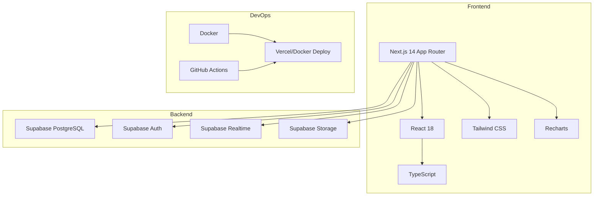

---

## High-Level Architecture

### System Architecture Diagram

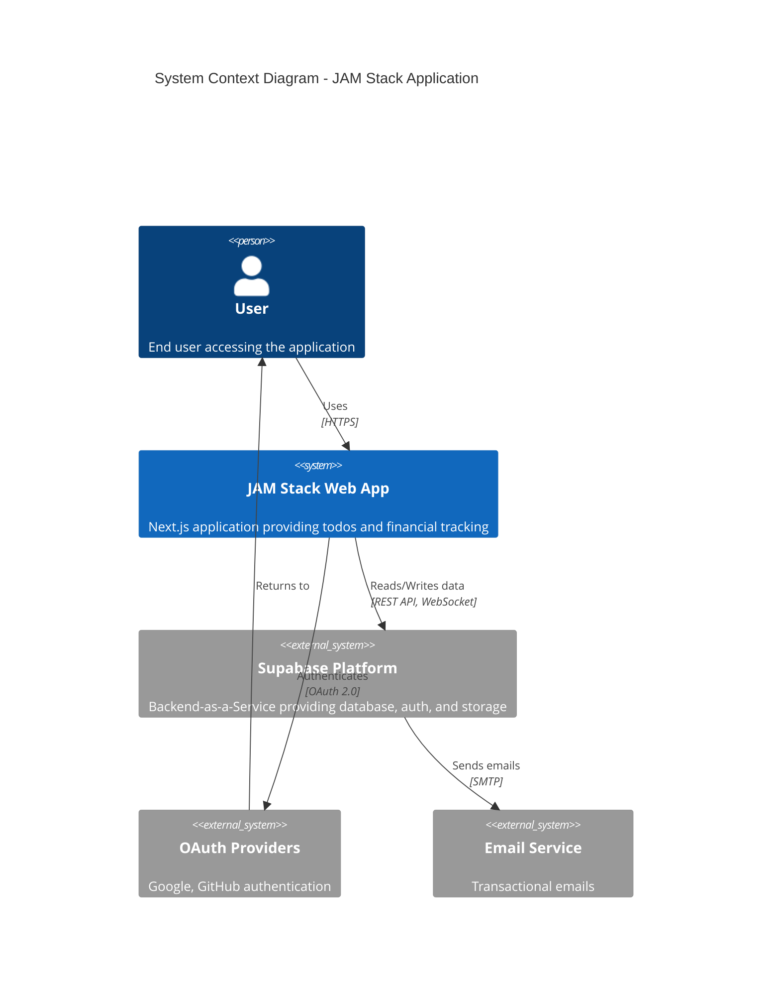

### Container Architecture

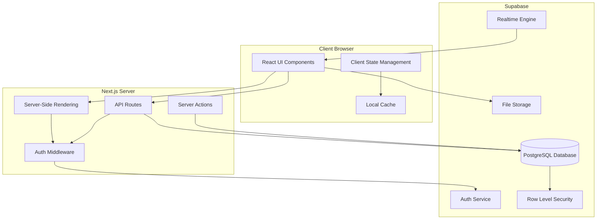

---

## Database Architecture

### Entity Relationship Diagram

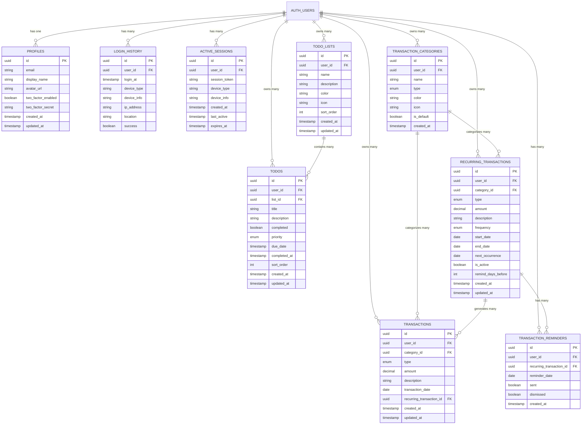

### Database Schema Layers

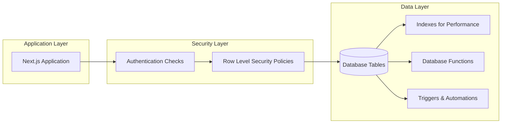

---

## Authentication Flow

### Email/Password Authentication

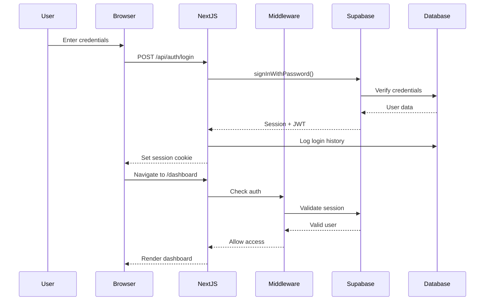

### OAuth Flow (Google/GitHub)

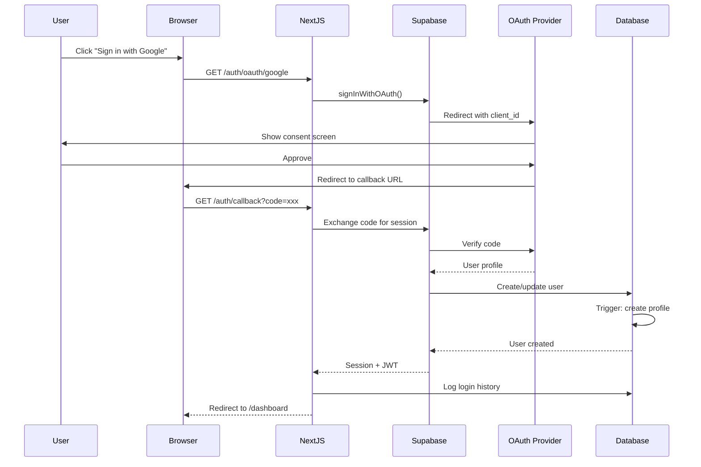

### Two-Factor Authentication Flow

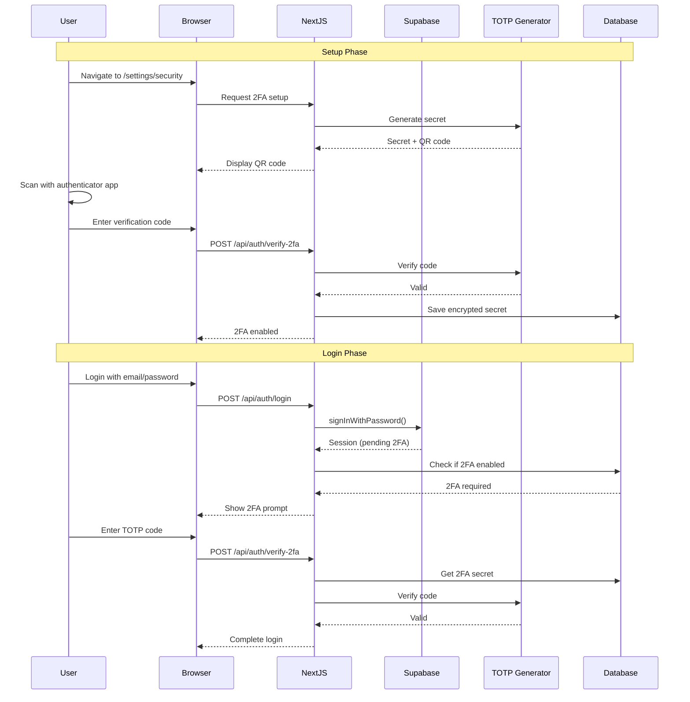

---

## Application Flow

### Todo Management Flow

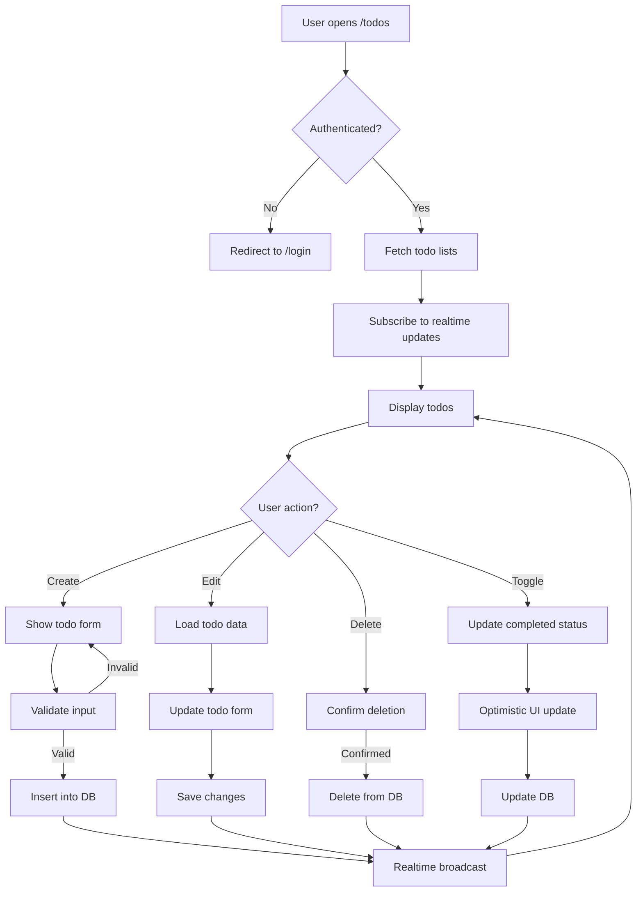

### Transaction Tracking Flow

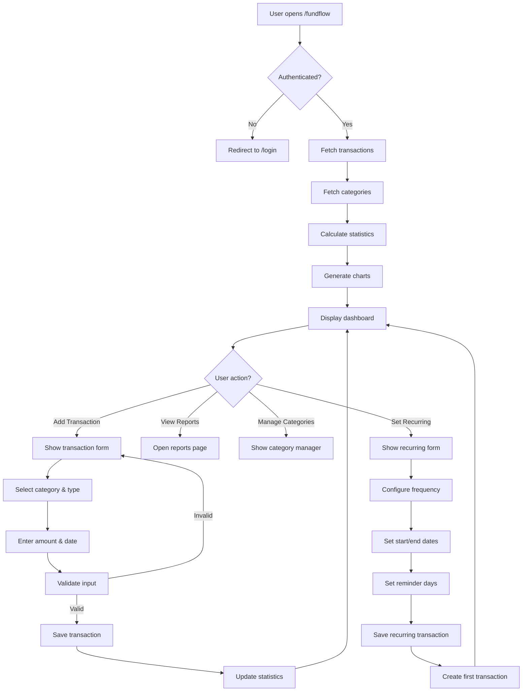

### Recurring Transaction Processing

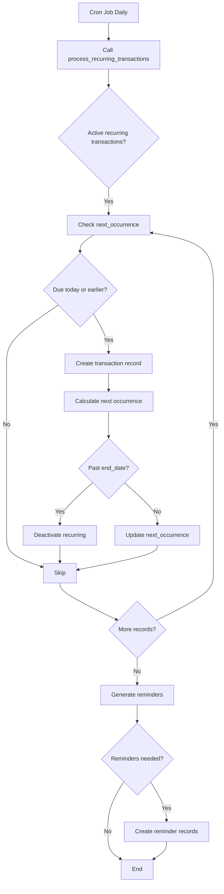

---

## Component Architecture

### Frontend Component Hierarchy

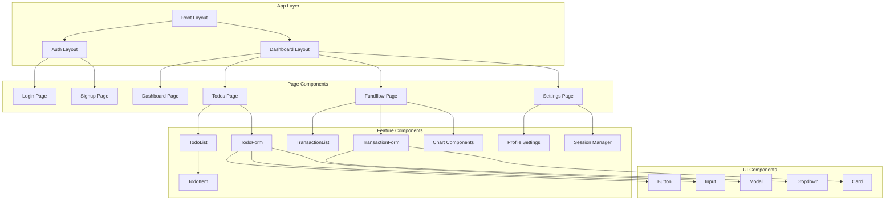

### State Management Pattern

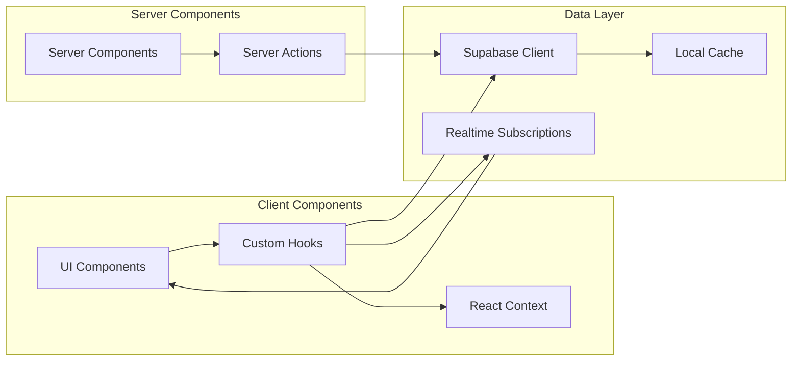

---

## API Architecture

### API Routes Structure

```mermaid
graph TB
    subgraph "API Routes /api"
        AUTH_ROUTES[/auth/*]
        TODO_ROUTES[/todos/*]
        TRANS_ROUTES[/transactions/*]
        REC_ROUTES[/recurring/*]
        REM_ROUTES[/reminders/*]
    end

    subgraph "Middleware Layers"
        CORS[CORS Handling]
        RATE_LIMIT[Rate Limiting]
        AUTH_CHECK[Authentication Check]
        VALIDATION[Input Validation]
    end

    subgraph "Business Logic"
        HANDLERS[Request Handlers]
        SERVICES[Service Layer]
        DATABASE[Database Operations]
    end

    AUTH_ROUTES --> CORS
    TODO_ROUTES --> CORS
    TRANS_ROUTES --> CORS

    CORS --> RATE_LIMIT
    RATE_LIMIT --> AUTH_CHECK
    AUTH_CHECK --> VALIDATION
    VALIDATION --> HANDLERS
    HANDLERS --> SERVICES
    SERVICES --> DATABASE
```

### Request/Response Flow

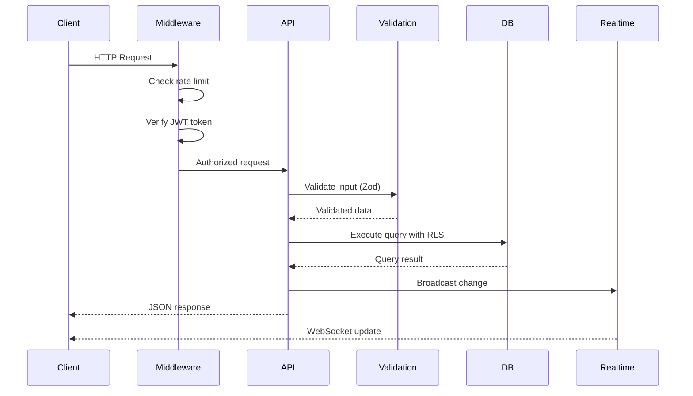

---

## Security Architecture

### Security Layers

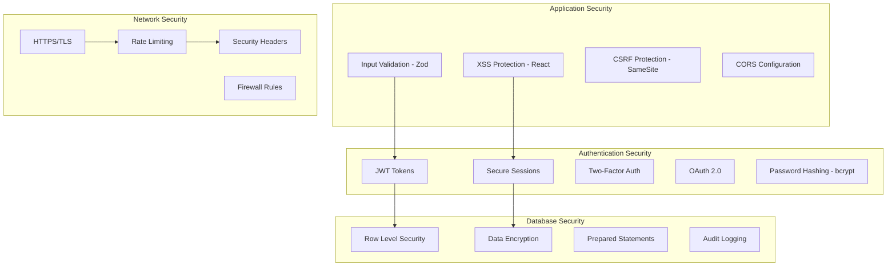

### Row Level Security Flow

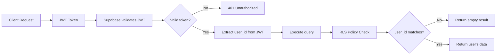

---

## Deployment Architecture

### Docker Deployment Architecture

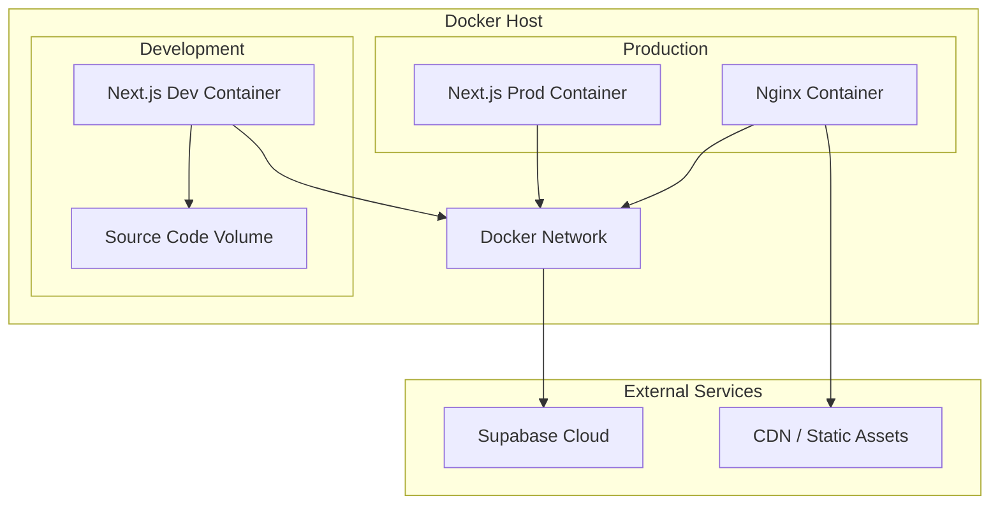

### CI/CD Pipeline

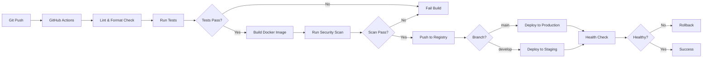

### Deployment Environments

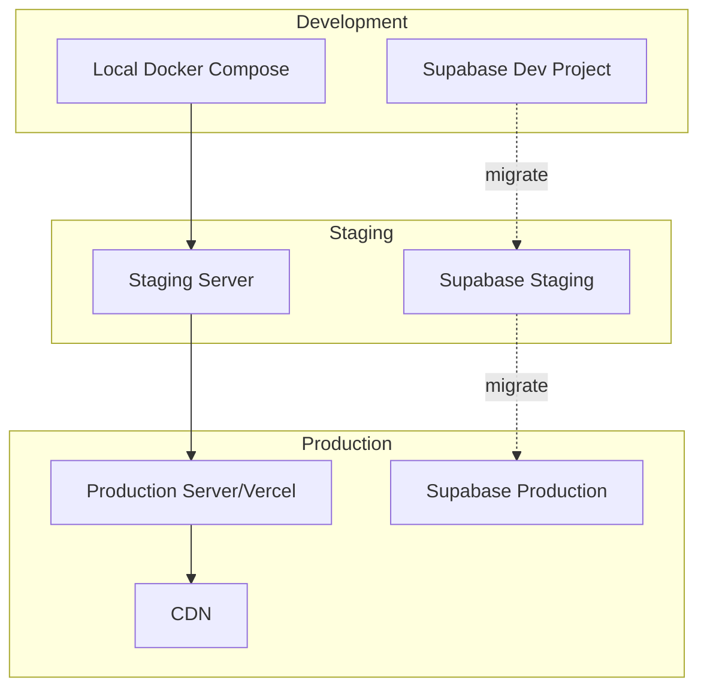

---

## Performance Architecture

### Caching Strategy

```mermaid
graph TB
    A[User Request] --> B{Cache Hit?}
    B -->|Yes| C[Return Cached Data]
    B -->|No| D[Fetch from Database]
    D --> E[Cache Result]
    E --> F[Return Data]

    subgraph "Cache Layers"
        G[Browser Cache]
        H[CDN Cache]
        I[Server Cache]
        J[Database Cache]
    end

    C --> G
    C --> H
    E --> I
    D --> J
```

### Optimization Strategies

```mermaid
mindmap
    root((Performance))
        Frontend
            Code Splitting
            Lazy Loading
            Image Optimization
            Minification
        Backend
            Database Indexing
            Query Optimization
            Connection Pooling
        Caching
            Static Assets
            API Responses
            Database Queries
        CDN
            Geographic Distribution
            Edge Caching
```

---

## Monitoring & Observability

### Monitoring Architecture

```mermaid
graph TB
    subgraph "Application"
        APP[Next.js App]
        API[API Routes]
    end

    subgraph "Monitoring Tools"
        LOGS[Log Aggregation]
        METRICS[Metrics Collection]
        ERRORS[Error Tracking]
        APM[Application Performance]
    end

    subgraph "Alerts"
        EMAIL[Email Alerts]
        SLACK[Slack Notifications]
        DASHBOARD[Monitoring Dashboard]
    end

    APP --> LOGS
    APP --> ERRORS
    API --> METRICS
    API --> APM

    LOGS --> DASHBOARD
    METRICS --> DASHBOARD
    ERRORS --> EMAIL
    APM --> SLACK
```

---

## Scalability Considerations

### Horizontal Scaling

```mermaid
graph TB
    LB[Load Balancer] --> APP1[App Instance 1]
    LB --> APP2[App Instance 2]
    LB --> APP3[App Instance 3]

    APP1 --> DB[(Database - Supabase)]
    APP2 --> DB
    APP3 --> DB

    DB --> REPLICA1[(Read Replica 1)]
    DB --> REPLICA2[(Read Replica 2)]
```

### Database Scaling

```mermaid
graph LR
    WRITE[Write Operations] --> PRIMARY[(Primary DB)]
    READ[Read Operations] --> ROUTER{Read Router}
    ROUTER --> REPLICA1[(Replica 1)]
    ROUTER --> REPLICA2[(Replica 2)]
    ROUTER --> REPLICA3[(Replica 3)]
    PRIMARY -.replication.-> REPLICA1
    PRIMARY -.replication.-> REPLICA2
    PRIMARY -.replication.-> REPLICA3
```

---

## Future Architecture Enhancements

1. **Microservices Migration**: Break down into smaller services
2. **Event-Driven Architecture**: Implement message queues for async processing
3. **GraphQL API**: Provide GraphQL endpoint alongside REST
4. **Mobile Apps**: React Native apps using same backend
5. **AI Integration**: ML-based insights and recommendations
6. **Multi-tenancy**: Support for organizations and teams
7. **Elasticsearch**: Advanced search capabilities
8. **Redis**: Distributed caching layer

---

*Last Updated: 2025-12-20*
*Version: 1.0.0*
