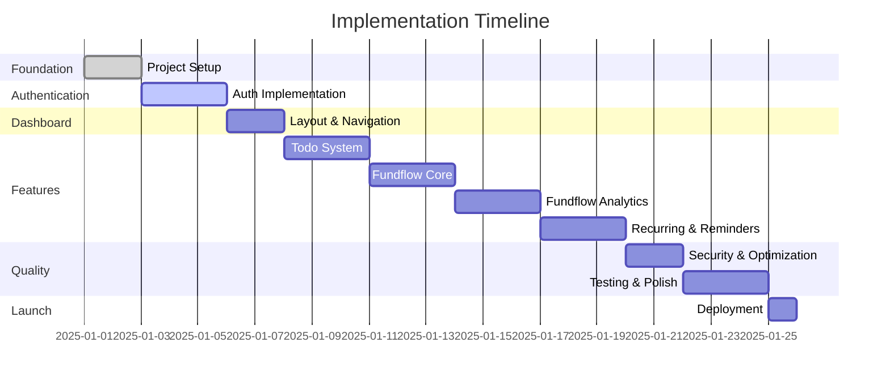
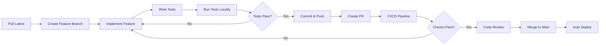

# Implementation Plan

## Table of Contents
1. [Overview](#overview)
2. [Phase Breakdown](#phase-breakdown)
3. [Implementation Timeline](#implementation-timeline)
4. [Development Workflow](#development-workflow)
5. [Quality Assurance](#quality-assurance)
6. [Risk Management](#risk-management)

---

## Overview

This document outlines the detailed implementation plan for the JAM Stack Application, organized into 10 phases spanning approximately 25 days of development.

### Project Goals

- Build a secure, scalable web application
- Implement comprehensive authentication with 2FA
- Create intuitive todo management system
- Develop financial tracking with analytics
- Ensure 100% test coverage on critical paths
- Deploy to production with CI/CD pipeline

### Success Criteria

✅ All authentication flows working securely
✅ Real-time todo synchronization functional
✅ Financial reports displaying accurate data
✅ 90%+ test coverage achieved
✅ Sub-3 second page load times
✅ Mobile-responsive on all devices
✅ Zero security vulnerabilities
✅ Successful production deployment

---

## Phase Breakdown

### Phase 1: Foundation (Days 1-2) ✅ COMPLETED

#### Objectives
- Setup development environment
- Configure database schema
- Establish project structure
- Setup development tools

#### Tasks

**1.1 Project Initialization**
```bash
# Initialize Next.js project
npx create-next-app@latest jam-stack-app \\
  --typescript --tailwind --app --src-dir

# Install dependencies
npm install @supabase/supabase-js @supabase/ssr \\
  recharts date-fns zod @radix-ui/react-* \\
  react-hook-form sonner lucide-react \\
  speakeasy qrcode clsx tailwind-merge
```

**1.2 Supabase Setup**
- Create project at supabase.com
- Configure authentication providers (Email, Google, GitHub)
- Save API credentials to `.env.local`
- Generate TypeScript types: `npx supabase gen types typescript`

**1.3 Database Migrations**
Run migrations in SQL Editor:
1. `001_initial_schema.sql` - Create all tables
2. `002_rls_policies.sql` - Enable security policies
3. `003_indexes.sql` - Add performance indexes
4. `004_functions.sql` - Create database functions

**1.4 Project Structure**
```
jam-stack-app/
├── src/
│   ├── app/                 # Next.js pages
│   ├── components/          # React components
│   ├── lib/                 # Utilities & configs
│   └── types/               # TypeScript definitions
├── supabase/migrations/     # Database migrations
├── docs/                    # Documentation
└── tests/                   # Test files
```

#### Deliverables
- ✅ Next.js project initialized
- ✅ All dependencies installed
- ✅ Database schema created
- ✅ Supabase clients configured
- ✅ Middleware implemented
- ✅ Environment variables configured

#### Testing
- [x] Development server starts successfully
- [x] Database migrations run without errors
- [x] TypeScript compilation passes
- [x] Middleware protects routes correctly

---

### Phase 2: Authentication (Days 3-5)

#### Objectives
- Implement email/password authentication
- Add OAuth integration
- Build profile management
- Implement 2FA
- Create session management

#### Tasks

**2.1 Email/Password Authentication**

Create auth route group:
```typescript
// src/app/(auth)/login/page.tsx
import { LoginForm } from '@/components/auth/LoginForm'

export default function LoginPage() {
  return <LoginForm />
}
```

Implement LoginForm:
- Email/password input with validation
- "Remember me" checkbox
- "Forgot password" link
- Error handling with toast notifications
- Loading states during authentication

**2.2 OAuth Integration**

Configure OAuth providers in Supabase Dashboard:
- Enable Google OAuth
- Enable GitHub OAuth
- Set redirect URLs

Create OAuth buttons:
```typescript
// src/components/auth/SocialAuthButtons.tsx
import { FaGoogle, FaGithub } from 'react-icons/fa'

export function SocialAuthButtons() {
  const handleOAuthLogin = async (provider: 'google' | 'github') => {
    const { error } = await supabase.auth.signInWithOAuth({
      provider,
      options: {
        redirectTo: `${window.location.origin}/auth/callback`,
      },
    })
    // Handle error
  }

  return (
    <div className="space-y-2">
      <Button onClick={() => handleOAuthLogin('google')}>
        <FaGoogle /> Continue with Google
      </Button>
      <Button onClick={() => handleOAuthLogin('github')}>
        <FaGithub /> Continue with GitHub
      </Button>
    </div>
  )
}
```

Create callback handler:
```typescript
// src/app/auth/callback/route.ts
export async function GET(request: Request) {
  const { searchParams } = new URL(request.url)
  const code = searchParams.get('code')

  if (code) {
    const supabase = createClient()
    await supabase.auth.exchangeCodeForSession(code)
  }

  return NextResponse.redirect(new URL('/dashboard', request.url))
}
```

**2.3 Password Reset Flow**

Create reset password page:
- Email input form
- Send reset email via Supabase
- Handle reset token in callback
- Allow user to set new password

**2.4 Profile Management**

Create profile settings page:
```typescript
// src/components/settings/ProfileSettings.tsx
- Display name input
- Email input (with verification)
- Avatar upload to Supabase Storage
- Save button with loading state
```

**2.5 Two-Factor Authentication**

Setup 2FA:
```typescript
// src/components/auth/TwoFactorSetup.tsx
import speakeasy from 'speakeasy'
import QRCode from 'qrcode'

export function TwoFactorSetup() {
  const [secret, setSecret] = useState('')
  const [qrCode, setQrCode] = useState('')

  const generateSecret = async () => {
    const secret = speakeasy.generateSecret({
      name: `JAM Stack (${user.email})`,
    })
    setSecret(secret.base32)

    const qrCodeUrl = await QRCode.toDataURL(secret.otpauth_url!)
    setQrCode(qrCodeUrl)
  }

  const verifyAndEnable = async (token: string) => {
    const verified = speakeasy.totp.verify({
      secret,
      encoding: 'base32',
      token,
    })

    if (verified) {
      // Save encrypted secret to database
      await saveSecret(secret)
    }
  }

  return (
    <div>
      <Button onClick={generateSecret}>Enable 2FA</Button>
      {qrCode && }
      <Input placeholder="Enter 6-digit code" onChange={verifyAndEnable} />
    </div>
  )
}
```

**2.6 Session Management**

Track sessions on login:
```typescript
// Track device and location
const deviceInfo = {
  type: getDeviceType(navigator.userAgent),
  info: getBrowserInfo(navigator.userAgent),
  ipAddress: await fetch('https://api.ipify.org').then(r => r.text()),
}

// Create session record
await supabase.from('active_sessions').insert({
  user_id: user.id,
  session_token: sessionToken,
  ...deviceInfo,
  expires_at: new Date(Date.now() + 7 * 24 * 60 * 60 * 1000),
})

// Log login history
await supabase.from('login_history').insert({
  user_id: user.id,
  ...deviceInfo,
  success: true,
})
```

Display active sessions:
```typescript
// src/components/settings/SessionList.tsx
- List all active sessions
- Show device type, last active time
- "Logout from this device" button
- "Logout from all devices" button
```

#### Deliverables
- [ ] Email/password login & signup working
- [ ] OAuth (Google, GitHub) functional
- [ ] Password reset flow complete
- [ ] Profile management working
- [ ] 2FA setup and verification working
- [ ] Session tracking implemented
- [ ] Login history displayed

#### Testing
- [ ] Test successful login/signup
- [ ] Test failed login (wrong password)
- [ ] Test OAuth flows
- [ ] Test password reset
- [ ] Test 2FA setup and login
- [ ] Test session logout
- [ ] Verify login history records

---

### Phase 3: Dashboard Layout (Days 6-7)

#### Objectives
- Create dashboard layout with sidebar
- Build navigation components
- Implement responsive design
- Create dashboard overview page

#### Tasks

**3.1 Dashboard Layout**

Create layout component:
```typescript
// src/app/(dashboard)/layout.tsx
import { Sidebar } from '@/components/layout/Sidebar'
import { Header } from '@/components/layout/Header'

export default function DashboardLayout({ children }) {
  return (
    <div className="flex h-screen">
      {/* Sidebar - hidden on mobile */}
      <Sidebar className="hidden lg:block" />

      <div className="flex-1 flex flex-col overflow-hidden">
        {/* Header */}
        <Header />

        {/* Main content */}
        <main className="flex-1 overflow-y-auto p-6">
          {children}
        </main>
      </div>

      {/* Mobile menu */}
      <MobileMenu className="lg:hidden" />
    </div>
  )
}
```

**3.2 Sidebar Component**

```typescript
// src/components/layout/Sidebar.tsx
import { LayoutDashboard, CheckSquare, DollarSign, Settings } from 'lucide-react'

const navigation = [
  { name: 'Dashboard', href: '/dashboard', icon: LayoutDashboard },
  { name: 'Todos', href: '/todos', icon: CheckSquare },
  { name: 'Fundflow', href: '/fundflow', icon: DollarSign },
  { name: 'Settings', href: '/settings', icon: Settings },
]

export function Sidebar() {
  return (
    <aside className="w-64 bg-white border-r">
      <nav className="p-4 space-y-2">
        {navigation.map((item) => (
          <Link
            key={item.name}
            href={item.href}
            className="flex items-center gap-3 px-3 py-2 rounded-lg hover:bg-gray-100"
          >
            <item.icon className="w-5 h-5" />
            <span>{item.name}</span>
          </Link>
        ))}
      </nav>
    </aside>
  )
}
```

**3.3 Header Component**

```typescript
// src/components/layout/Header.tsx
import { UserMenu } from './UserMenu'

export function Header() {
  return (
    <header className="h-16 border-b bg-white px-6 flex items-center justify-between">
      {/* Page title */}
      <h1 className="text-2xl font-semibold">Dashboard</h1>

      {/* User menu */}
      <UserMenu />
    </header>
  )
}
```

**3.4 Dashboard Overview**

Create dashboard with stats:
```typescript
// src/app/(dashboard)/dashboard/page.tsx
export default async function DashboardPage() {
  const stats = await getStats()

  return (
    <div className="space-y-6">
      {/* Stats cards */}
      <div className="grid grid-cols-1 md:grid-cols-2 lg:grid-cols-4 gap-4">
        <StatsCard
          title="Total Todos"
          value={stats.totalTodos}
          icon={<CheckSquare />}
        />
        <StatsCard
          title="Pending"
          value={stats.pendingTodos}
          icon={<Clock />}
        />
        <StatsCard
          title="Monthly Income"
          value={formatCurrency(stats.monthlyIncome)}
          icon={<TrendingUp />}
        />
        <StatsCard
          title="Monthly Expenses"
          value={formatCurrency(stats.monthlyExpenses)}
          icon={<TrendingDown />}
        />
      </div>

      {/* Recent activity */}
      <Card>
        <CardHeader>
          <CardTitle>Recent Activity</CardTitle>
        </CardHeader>
        <CardContent>
          <ActivityFeed items={stats.recentActivity} />
        </CardContent>
      </Card>

      {/* Quick actions */}
      <div className="grid grid-cols-1 md:grid-cols-2 gap-4">
        <QuickActionCard
          title="Add Todo"
          description="Create a new task"
          action={() => openTodoModal()}
        />
        <QuickActionCard
          title="Add Transaction"
          description="Record income or expense"
          action={() => openTransactionModal()}
        />
      </div>
    </div>
  )
}
```

#### Deliverables
- [ ] Dashboard layout implemented
- [ ] Sidebar navigation working
- [ ] Header with user menu
- [ ] Mobile responsive menu
- [ ] Dashboard overview page with stats
- [ ] Fully responsive on all screen sizes

#### Testing
- [ ] Test navigation between pages
- [ ] Test responsive layout on mobile/tablet/desktop
- [ ] Test user menu dropdown
- [ ] Verify stats display correctly

---

### Phase 4: Todo System (Days 8-10)

#### Objectives
- Implement todo CRUD operations
- Add real-time synchronization
- Create todo lists organization
- Build filtering and sorting

#### Tasks

**4.1 Custom Hook for Todos**

```typescript
// src/lib/hooks/useTodos.ts
export function useTodos(listId?: string) {
  const [todos, setTodos] = useState<Todo[]>([])
  const [loading, setLoading] = useState(true)
  const supabase = createClient()

  useEffect(() => {
    fetchTodos()

    // Realtime subscription
    const channel = supabase
      .channel('todos-changes')
      .on('postgres_changes', {
        event: '*',
        schema: 'public',
        table: 'todos',
        filter: listId ? `list_id=eq.${listId}` : undefined,
      }, handleRealtimeUpdate)
      .subscribe()

    return () => {
      supabase.removeChannel(channel)
    }
  }, [listId])

  const createTodo = async (todo: Partial<Todo>) => {
    const { data, error } = await supabase
      .from('todos')
      .insert(todo)
      .select()
      .single()
    return { data, error }
  }

  const updateTodo = async (id: string, updates: Partial<Todo>) => {
    const { data, error } = await supabase
      .from('todos')
      .update(updates)
      .eq('id', id)
      .select()
      .single()
    return { data, error }
  }

  const deleteTodo = async (id: string) => {
    const { error } = await supabase
      .from('todos')
      .delete()
      .eq('id', id)
    return { error }
  }

  return {
    todos,
    loading,
    createTodo,
    updateTodo,
    deleteTodo,
  }
}
```

**4.2 Todo List Component**

```typescript
// src/components/todos/TodoList.tsx
export function TodoList() {
  const { todos, createTodo, updateTodo, deleteTodo } = useTodos()
  const [filter, setFilter] = useState<'all' | 'active' | 'completed'>('all')

  const filteredTodos = todos.filter((todo) => {
    if (filter === 'active') return !todo.completed
    if (filter === 'completed') return todo.completed
    return true
  })

  return (
    <div>
      {/* Filter tabs */}
      <Tabs value={filter} onValueChange={setFilter}>
        <TabsList>
          <TabsTrigger value="all">All</TabsTrigger>
          <TabsTrigger value="active">Active</TabsTrigger>
          <TabsTrigger value="completed">Completed</TabsTrigger>
        </TabsList>
      </Tabs>

      {/* Todo items */}
      <div className="space-y-2 mt-4">
        {filteredTodos.map((todo) => (
          <TodoItem
            key={todo.id}
            todo={todo}
            onUpdate={updateTodo}
            onDelete={deleteTodo}
          />
        ))}
      </div>

      {/* Add todo button */}
      <Button onClick={() => setShowForm(true)}>
        <Plus /> Add Todo
      </Button>
    </div>
  )
}
```

**4.3 Todo Form**

```typescript
// src/components/todos/TodoForm.tsx
import { useForm } from 'react-hook-form'
import { zodResolver } from '@hookform/resolvers/zod'
import { todoSchema } from '@/lib/utils/validators'

export function TodoForm({ onSubmit, initialData }) {
  const form = useForm({
    resolver: zodResolver(todoSchema),
    defaultValues: initialData,
  })

  return (
    <form onSubmit={form.handleSubmit(onSubmit)}>
      <Input
        {...form.register('title')}
        placeholder="What needs to be done?"
      />
      {form.formState.errors.title && (
        <p className="text-red-500 text-sm">
          {form.formState.errors.title.message}
        </p>
      )}

      <Textarea
        {...form.register('description')}
        placeholder="Description (optional)"
      />

      <Select {...form.register('priority')}>
        <option value="low">Low</option>
        <option value="medium">Medium</option>
        <option value="high">High</option>
        <option value="urgent">Urgent</option>
      </Select>

      <DatePicker
        {...form.register('dueDate')}
        placeholder="Due date"
      />

      <Button type="submit" disabled={form.formState.isSubmitting}>
        {form.formState.isSubmitting ? 'Saving...' : 'Save Todo'}
      </Button>
    </form>
  )
}
```

#### Deliverables
- [ ] Todo CRUD operations working
- [ ] Real-time sync functional
- [ ] Todo lists organization
- [ ] Filtering (all/active/completed)
- [ ] Priority levels working
- [ ] Due dates functional
- [ ] Optimistic UI updates

#### Testing
- [ ] Create, update, delete todos
- [ ] Test real-time sync across tabs
- [ ] Test filters
- [ ] Test priority sorting
- [ ] Test due date reminders
- [ ] Verify RLS policies

---

### Phase 5-7: Fundflow Tracker (Days 11-19)

*[Similar detailed breakdown for Fundflow features]*

---

### Phase 8: Security & Optimization (Days 20-21)

#### Objectives
- Implement comprehensive security measures
- Optimize performance
- Add error handling

#### Tasks

**8.1 Input Validation**
- Add Zod schemas to all forms
- Implement server-side validation
- Add CSRF protection

**8.2 Performance Optimization**
- Add React.memo to expensive components
- Implement code splitting
- Optimize images with Next.js Image
- Add loading skeletons

**8.3 Error Handling**
- Create error boundary components
- Add global error handler
- Implement error logging

#### Deliverables
- [ ] All forms validated
- [ ] Performance optimized
- [ ] Error handling implemented
- [ ] Security audit passed

---

### Phase 9: Testing (Days 22-24)

#### Objectives
- Achieve 90%+ test coverage
- Test all critical paths
- Perform security testing

#### Testing Strategy
See `docs/TESTING.md` for complete test plan.

---

### Phase 10: Deployment (Day 25)

#### Objectives
- Deploy to production
- Configure monitoring
- Document deployment process

#### Tasks
See `docs/DEPLOYMENT.md` for deployment guide.

---

## Implementation Timeline



---

## Development Workflow

### Daily Workflow



### Git Branching Strategy

- `main` - Production-ready code
- `develop` - Integration branch
- `feature/*` - Feature branches
- `bugfix/*` - Bug fixes
- `hotfix/*` - Production hotfixes

### Commit Convention

```
<type>(<scope>): <subject>

<body>

<footer>
```

Types: `feat`, `fix`, `docs`, `style`, `refactor`, `test`, `chore`

Example:
```
feat(auth): implement two-factor authentication

- Add TOTP secret generation
- Create QR code display
- Implement verification flow

Closes #123
```

---

## Quality Assurance

### Code Quality Checklist

- [ ] Code follows TypeScript best practices
- [ ] All functions have proper type definitions
- [ ] No `any` types used
- [ ] ESLint passes with no warnings
- [ ] Prettier formatting applied
- [ ] No console.log statements
- [ ] Error handling implemented
- [ ] Loading states added
- [ ] Optimistic UI updates where applicable

### Testing Checklist

- [ ] Unit tests for utilities
- [ ] Integration tests for features
- [ ] E2E tests for critical paths
- [ ] 90%+ code coverage
- [ ] All edge cases covered
- [ ] Error scenarios tested

### Security Checklist

- [ ] All inputs validated (client + server)
- [ ] SQL injection prevented (Supabase handles this)
- [ ] XSS prevention (React handles this)
- [ ] CSRF protection enabled
- [ ] Sensitive data encrypted
- [ ] Secure session management
- [ ] Rate limiting implemented
- [ ] Security headers configured

---

## Risk Management

### Potential Risks & Mitigation

| Risk | Probability | Impact | Mitigation |
|------|-------------|--------|------------|
| Supabase API changes | Low | High | Pin Supabase version, monitor changelog |
| OAuth provider issues | Medium | Medium | Implement fallback email auth |
| Performance issues with large data | Medium | High | Implement pagination, indexing |
| Security vulnerabilities | Low | Critical | Regular audits, automated scanning |
| Real-time sync failures | Low | Medium | Implement offline-first approach |
| Third-party dependency issues | Medium | Medium | Lock dependency versions, test updates |

### Contingency Plans

**If Supabase has outage:**
- Implement local caching
- Queue operations for retry
- Display offline message to users

**If OAuth fails:**
- Fall back to email/password authentication
- Provide clear error messages
- Contact support for resolution

**If performance degrades:**
- Enable query caching
- Implement pagination
- Optimize database queries
- Scale Supabase plan

---

*Last Updated: 2025-12-20*
*Version: 1.0.0*
