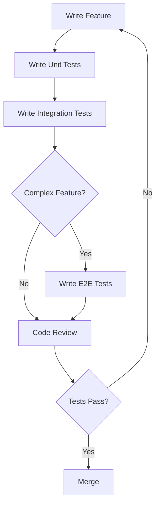
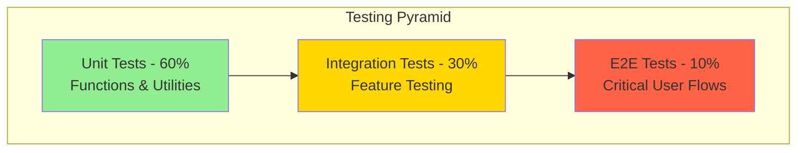
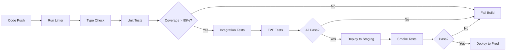

# Testing Documentation

## Table of Contents
1. [Testing Strategy](#testing-strategy)
2. [Testing Pyramid](#testing-pyramid)
3. [Unit Tests](#unit-tests)
4. [Integration Tests](#integration-tests)
5. [End-to-End Tests](#end-to-end-tests)
6. [Test Coverage](#test-coverage)
7. [Running Tests](#running-tests)
8. [Test Cases](#test-cases)
9. [Continuous Testing](#continuous-testing)

---

## Testing Strategy

### Goals

- Achieve 90%+ code coverage on critical paths
- Prevent regressions with automated tests
- Ensure security and performance standards
- Maintain code quality and reliability

### Testing Approach



---

## Testing Pyramid



### Test Distribution

- **60% Unit Tests**: Test individual functions, utilities, and hooks
- **30% Integration Tests**: Test feature interactions and components
- **10% E2E Tests**: Test critical user journeys

---

## Unit Tests

### What to Test

✅ **Utility Functions**
- Currency formatting
- Date formatting
- Validation schemas
- Data transformations

✅ **Custom Hooks**
- Data fetching
- State management
- Error handling

✅ **Helper Functions**
- Analytics calculations
- Device detection
- String manipulations

### Example: Testing Utility Functions

```typescript
// src/lib/utils/__tests__/currency.test.ts
import { formatCurrency, formatCurrencyCompact, parseCurrencyInput } from '../currency'

describe('Currency Utils', () => {
  describe('formatCurrency', () => {
    it('should format positive numbers correctly', () => {
      expect(formatCurrency(1000)).toBe('$1,000.00')
      expect(formatCurrency(1234.56)).toBe('$1,234.56')
    })

    it('should format zero correctly', () => {
      expect(formatCurrency(0)).toBe('$0.00')
    })

    it('should format negative numbers correctly', () => {
      expect(formatCurrency(-500)).toBe('-$500.00')
    })

    it('should handle different currencies', () => {
      expect(formatCurrency(1000, 'EUR')).toBe('€1,000.00')
      expect(formatCurrency(1000, 'GBP')).toBe('£1,000.00')
    })
  })

  describe('formatCurrencyCompact', () => {
    it('should format large numbers compactly', () => {
      expect(formatCurrencyCompact(1000)).toBe('$1K')
      expect(formatCurrencyCompact(1000000)).toBe('$1M')
    })
  })

  describe('parseCurrencyInput', () => {
    it('should parse currency strings to numbers', () => {
      expect(parseCurrencyInput('$1,234.56')).toBe(1234.56)
      expect(parseCurrencyInput('1234.56')).toBe(1234.56)
      expect(parseCurrencyInput('$1,000')).toBe(1000)
    })

    it('should handle invalid input', () => {
      expect(parseCurrencyInput('invalid')).toBe(0)
      expect(parseCurrencyInput('')).toBe(0)
    })
  })
})
```

### Example: Testing Validation Schemas

```typescript
// src/lib/utils/__tests__/validators.test.ts
import { todoSchema, transactionSchema } from '../validators'

describe('Validation Schemas', () => {
  describe('todoSchema', () => {
    it('should validate valid todo data', () => {
      const validTodo = {
        title: 'Test Todo',
        description: 'Test description',
        priority: 'high',
        dueDate: '2025-12-31',
      }

      expect(() => todoSchema.parse(validTodo)).not.toThrow()
    })

    it('should reject missing title', () => {
      const invalidTodo = {
        description: 'Test description',
      }

      expect(() => todoSchema.parse(invalidTodo)).toThrow()
    })

    it('should reject invalid priority', () => {
      const invalidTodo = {
        title: 'Test',
        priority: 'invalid',
      }

      expect(() => todoSchema.parse(invalidTodo)).toThrow()
    })
  })

  describe('transactionSchema', () => {
    it('should validate valid transaction data', () => {
      const validTransaction = {
        type: 'expense',
        amount: 99.99,
        transactionDate: '2025-12-20',
      }

      expect(() => transactionSchema.parse(validTransaction)).not.toThrow()
    })

    it('should reject negative amounts', () => {
      const invalidTransaction = {
        type: 'expense',
        amount: -50,
        transactionDate: '2025-12-20',
      }

      expect(() => transactionSchema.parse(invalidTransaction)).toThrow()
    })

    it('should reject amounts exceeding maximum', () => {
      const invalidTransaction = {
        type: 'expense',
        amount: 1000000000,
        transactionDate: '2025-12-20',
      }

      expect(() => transactionSchema.parse(invalidTransaction)).toThrow()
    })
  })
})
```

### Example: Testing Custom Hooks

```typescript
// src/lib/hooks/__tests__/useTodos.test.ts
import { renderHook, waitFor } from '@testing-library/react'
import { useTodos } from '../useTodos'
import { createClient } from '@/lib/supabase/client'

jest.mock('@/lib/supabase/client')

describe('useTodos Hook', () => {
  const mockSupabase = {
    from: jest.fn(),
    channel: jest.fn(),
  }

  beforeEach(() => {
    ;(createClient as jest.Mock).mockReturnValue(mockSupabase)
    mockSupabase.from.mockReturnValue({
      select: jest.fn().mockReturnValue({
        order: jest.fn().mockResolvedValue({
          data: [],
          error: null,
        }),
      }),
      insert: jest.fn().mockResolvedValue({
        data: { id: '1', title: 'Test Todo' },
        error: null,
      }),
      update: jest.fn().mockResolvedValue({ data: {}, error: null }),
      delete: jest.fn().mockResolvedValue({ error: null }),
    })

    mockSupabase.channel.mockReturnValue({
      on: jest.fn().mockReturnThis(),
      subscribe: jest.fn().mockReturnThis(),
    })
  })

  it('should fetch todos on mount', async () => {
    const { result } = renderHook(() => useTodos())

    await waitFor(() => {
      expect(result.current.loading).toBe(false)
    })

    expect(mockSupabase.from).toHaveBeenCalledWith('todos')
  })

  it('should create a todo', async () => {
    const { result } = renderHook(() => useTodos())

    await waitFor(() => {
      expect(result.current.loading).toBe(false)
    })

    const newTodo = { title: 'New Todo', description: 'Test' }
    const { data, error } = await result.current.createTodo(newTodo)

    expect(data).toEqual({ id: '1', title: 'Test Todo' })
    expect(error).toBeNull()
  })

  it('should update a todo', async () => {
    const { result } = renderHook(() => useTodos())

    await waitFor(() => {
      expect(result.current.loading).toBe(false)
    })

    const { error } = await result.current.updateTodo('1', { completed: true })

    expect(error).toBeNull()
  })

  it('should delete a todo', async () => {
    const { result } = renderHook(() => useTodos())

    await waitFor(() => {
      expect(result.current.loading).toBe(false)
    })

    const { error } = await result.current.deleteTodo('1')

    expect(error).toBeNull()
  })
})
```

---

## Integration Tests

### What to Test

✅ **Authentication Flows**
- Login, signup, logout
- OAuth integration
- Password reset
- 2FA setup and verification

✅ **Feature Interactions**
- Todo creation and real-time updates
- Transaction filtering and sorting
- Category management

✅ **Component Integration**
- Form submission and validation
- Data fetching and display
- Error handling

### Example: Testing Authentication Flow

```typescript
// __tests__/integration/auth.test.tsx
import { render, screen, fireEvent, waitFor } from '@testing-library/react'
import { LoginPage } from '@/app/(auth)/login/page'
import { createClient } from '@/lib/supabase/client'

jest.mock('@/lib/supabase/client')

describe('Authentication Integration', () => {
  const mockSupabase = {
    auth: {
      signInWithPassword: jest.fn(),
      signOut: jest.fn(),
    },
  }

  beforeEach(() => {
    ;(createClient as jest.Mock).mockReturnValue(mockSupabase)
  })

  it('should login successfully with valid credentials', async () => {
    mockSupabase.auth.signInWithPassword.mockResolvedValue({
      data: { user: { id: '1', email: 'test@example.com' } },
      error: null,
    })

    render(<LoginPage />)

    fireEvent.change(screen.getByLabelText(/email/i), {
      target: { value: 'test@example.com' },
    })
    fireEvent.change(screen.getByLabelText(/password/i), {
      target: { value: 'password123' },
    })

    fireEvent.click(screen.getByRole('button', { name: /sign in/i }))

    await waitFor(() => {
      expect(mockSupabase.auth.signInWithPassword).toHaveBeenCalledWith({
        email: 'test@example.com',
        password: 'password123',
      })
    })
  })

  it('should display error message on failed login', async () => {
    mockSupabase.auth.signInWithPassword.mockResolvedValue({
      data: null,
      error: { message: 'Invalid credentials' },
    })

    render(<LoginPage />)

    fireEvent.change(screen.getByLabelText(/email/i), {
      target: { value: 'test@example.com' },
    })
    fireEvent.change(screen.getByLabelText(/password/i), {
      target: { value: 'wrongpassword' },
    })

    fireEvent.click(screen.getByRole('button', { name: /sign in/i }))

    await waitFor(() => {
      expect(screen.getByText(/invalid credentials/i)).toBeInTheDocument()
    })
  })
})
```

### Example: Testing Todo CRUD Operations

```typescript
// __tests__/integration/todos.test.tsx
import { render, screen, fireEvent, waitFor } from '@testing-library/react'
import { TodoPage } from '@/app/(dashboard)/todos/page'
import { createClient } from '@/lib/supabase/client'

jest.mock('@/lib/supabase/client')

describe('Todo CRUD Integration', () => {
  const mockSupabase = {
    from: jest.fn(),
    channel: jest.fn(),
    removeChannel: jest.fn(),
  }

  const mockTodos = [
    { id: '1', title: 'Test Todo 1', completed: false },
    { id: '2', title: 'Test Todo 2', completed: true },
  ]

  beforeEach(() => {
    ;(createClient as jest.Mock).mockReturnValue(mockSupabase)

    mockSupabase.from.mockReturnValue({
      select: jest.fn().mockReturnValue({
        order: jest.fn().mockResolvedValue({
          data: mockTodos,
          error: null,
        }),
      }),
      insert: jest.fn().mockResolvedValue({
        data: { id: '3', title: 'New Todo', completed: false },
        error: null,
      }),
      update: jest.fn().mockResolvedValue({ error: null }),
      delete: jest.fn().mockResolvedValue({ error: null }),
      eq: jest.fn().mockReturnThis(),
    })

    mockSupabase.channel.mockReturnValue({
      on: jest.fn().mockReturnThis(),
      subscribe: jest.fn(),
    })
  })

  it('should display list of todos', async () => {
    render(<TodoPage />)

    await waitFor(() => {
      expect(screen.getByText('Test Todo 1')).toBeInTheDocument()
      expect(screen.getByText('Test Todo 2')).toBeInTheDocument()
    })
  })

  it('should create a new todo', async () => {
    render(<TodoPage />)

    fireEvent.click(screen.getByRole('button', { name: /add todo/i }))

    fireEvent.change(screen.getByPlaceholderText(/what needs to be done/i), {
      target: { value: 'New Todo' },
    })

    fireEvent.click(screen.getByRole('button', { name: /save/i }))

    await waitFor(() => {
      expect(mockSupabase.from).toHaveBeenCalledWith('todos')
    })
  })

  it('should toggle todo completion', async () => {
    render(<TodoPage />)

    await waitFor(() => {
      expect(screen.getByText('Test Todo 1')).toBeInTheDocument()
    })

    const checkbox = screen.getAllByRole('checkbox')[0]
    fireEvent.click(checkbox)

    await waitFor(() => {
      expect(mockSupabase.from).toHaveBeenCalledWith('todos')
    })
  })
})
```

---

## End-to-End Tests

### What to Test

✅ **Critical User Journeys**
- Complete signup and login flow
- Create and manage todos
- Add and track transactions
- Setup recurring transactions

### Example: E2E Test with Playwright

```typescript
// e2e/auth.spec.ts
import { test, expect } from '@playwright/test'

test.describe('Authentication Flow', () => {
  test('should complete full signup and login flow', async ({ page }) => {
    // Navigate to signup page
    await page.goto('http://localhost:3000/signup')

    // Fill signup form
    await page.fill('input[name="email"]', 'test@example.com')
    await page.fill('input[name="password"]', 'SecurePass123!')
    await page.fill('input[name="displayName"]', 'Test User')

    // Submit form
    await page.click('button[type="submit"]')

    // Wait for redirect to dashboard
    await page.waitForURL('**/dashboard')

    // Verify dashboard loaded
    await expect(page.locator('h1')).toContainText('Dashboard')

    // Logout
    await page.click('button[aria-label="User menu"]')
    await page.click('text=Logout')

    // Verify redirected to login
    await page.waitForURL('**/login')

    // Login with same credentials
    await page.fill('input[name="email"]', 'test@example.com')
    await page.fill('input[name="password"]', 'SecurePass123!')
    await page.click('button[type="submit"]')

    // Verify back on dashboard
    await page.waitForURL('**/dashboard')
    await expect(page.locator('h1')).toContainText('Dashboard')
  })

  test('should show error on invalid login', async ({ page }) => {
    await page.goto('http://localhost:3000/login')

    await page.fill('input[name="email"]', 'wrong@example.com')
    await page.fill('input[name="password"]', 'wrongpassword')
    await page.click('button[type="submit"]')

    // Verify error message appears
    await expect(page.locator('text=Invalid credentials')).toBeVisible()
  })
})
```

```typescript
// e2e/todos.spec.ts
import { test, expect } from '@playwright/test'

test.describe('Todo Management', () => {
  test.beforeEach(async ({ page }) => {
    // Login before each test
    await page.goto('http://localhost:3000/login')
    await page.fill('input[name="email"]', 'test@example.com')
    await page.fill('input[name="password"]', 'SecurePass123!')
    await page.click('button[type="submit"]')
    await page.waitForURL('**/dashboard')
  })

  test('should create, complete, and delete a todo', async ({ page }) => {
    // Navigate to todos
    await page.click('text=Todos')
    await page.waitForURL('**/todos')

    // Create new todo
    await page.click('button:has-text("Add Todo")')
    await page.fill('input[placeholder="What needs to be done?"]', 'Test Todo')
    await page.selectOption('select[name="priority"]', 'high')
    await page.click('button:has-text("Save")')

    // Verify todo appears in list
    await expect(page.locator('text=Test Todo')).toBeVisible()

    // Mark as complete
    await page.click('input[type="checkbox"]:near(text=Test Todo)')

    // Verify completed state
    await expect(
      page.locator('text=Test Todo').locator('..')
    ).toHaveClass(/completed/)

    // Delete todo
    await page.click('button[aria-label="Delete"]:near(text=Test Todo)')
    await page.click('button:has-text("Confirm")')

    // Verify todo removed
    await expect(page.locator('text=Test Todo')).not.toBeVisible()
  })

  test('should filter todos by status', async ({ page }) => {
    await page.goto('http://localhost:3000/todos')

    // Create active and completed todos
    // ... (create todos)

    // Test "Active" filter
    await page.click('button:has-text("Active")')
    await expect(page.locator('[data-completed="true"]')).not.toBeVisible()

    // Test "Completed" filter
    await page.click('button:has-text("Completed")')
    await expect(page.locator('[data-completed="false"]')).not.toBeVisible()

    // Test "All" filter
    await page.click('button:has-text("All")')
    await expect(page.locator('[data-completed="true"]')).toBeVisible()
    await expect(page.locator('[data-completed="false"]')).toBeVisible()
  })
})
```

---

## Test Coverage

### Coverage Goals

| Category | Target |
|----------|--------|
| Utilities | 95%+ |
| Hooks | 90%+ |
| Components | 80%+ |
| Pages | 70%+ |
| **Overall** | **85%+** |

### Generating Coverage Reports

```bash
# Run tests with coverage
npm run test:coverage

# Open coverage report
open coverage/lcov-report/index.html
```

### Coverage Report Example

```
---------------------|---------|----------|---------|---------|-------------------
File                 | % Stmts | % Branch | % Funcs | % Lines | Uncovered Line #s
---------------------|---------|----------|---------|---------|-------------------
All files            |   87.5  |   82.3   |   90.1  |   88.2  |
 lib/utils           |   95.2  |   91.5   |   96.3  |   95.8  |
  currency.ts        |   100   |   100    |   100   |   100   |
  date.ts            |   94.1  |   87.5   |   95.0  |   94.7  | 45-47
  validators.ts      |   92.3  |   88.9   |   94.4  |   93.1  | 78,102
 lib/hooks           |   88.7  |   84.2   |   91.3  |   89.4  |
  useTodos.ts        |   91.2  |   87.5   |   93.8  |   92.1  | 34,67
  useTransactions.ts |   86.3  |   81.2   |   89.1  |   86.8  | 23,45,78
---------------------|---------|----------|---------|---------|-------------------
```

---

## Running Tests

### Test Scripts

```json
{
  "scripts": {
    "test": "jest",
    "test:watch": "jest --watch",
    "test:coverage": "jest --coverage",
    "test:e2e": "playwright test",
    "test:e2e:ui": "playwright test --ui",
    "test:e2e:headed": "playwright test --headed",
    "test:all": "npm run test && npm run test:e2e"
  }
}
```

### Running Tests Locally

```bash
# Run all unit and integration tests
npm test

# Run tests in watch mode (for development)
npm run test:watch

# Run specific test file
npm test -- currency.test.ts

# Run tests with coverage
npm run test:coverage

# Run E2E tests
npm run test:e2e

# Run E2E tests with UI
npm run test:e2e:ui

# Run E2E tests in headed mode (see browser)
npm run test:e2e:headed

# Run all tests (unit + integration + E2E)
npm run test:all
```

### Pre-commit Testing

Tests automatically run on commit via Husky hooks:

```bash
# Pre-commit hook runs:
1. Linter (ESLint)
2. Formatter (Prettier)
3. Unit tests for changed files
4. Type checking

# Pre-push hook runs:
1. All unit tests
2. Coverage check
```

---

## Test Cases

### Authentication Test Cases

| Test ID | Test Case | Priority | Status |
|---------|-----------|----------|--------|
| AUTH-001 | User can sign up with email/password | High | ✅ |
| AUTH-002 | User receives validation errors for invalid email | High | ✅ |
| AUTH-003 | User receives validation errors for weak password | High | ✅ |
| AUTH-004 | User can login with valid credentials | High | ✅ |
| AUTH-005 | User receives error for invalid credentials | High | ✅ |
| AUTH-006 | User can login with Google OAuth | Medium | 📋 |
| AUTH-007 | User can login with GitHub OAuth | Medium | 📋 |
| AUTH-008 | User can request password reset | Medium | 📋 |
| AUTH-009 | User receives password reset email | Medium | 📋 |
| AUTH-010 | User can set new password with reset token | Medium | 📋 |
| AUTH-011 | User can setup 2FA | Medium | 📋 |
| AUTH-012 | User must enter 2FA code after password | Medium | 📋 |
| AUTH-013 | User can view active sessions | Low | 📋 |
| AUTH-014 | User can logout from specific device | Low | 📋 |
| AUTH-015 | User can view login history | Low | 📋 |

### Todo Test Cases

| Test ID | Test Case | Priority | Status |
|---------|-----------|----------|--------|
| TODO-001 | User can create a todo | High | 📋 |
| TODO-002 | User can view list of todos | High | 📋 |
| TODO-003 | User can edit a todo | High | 📋 |
| TODO-004 | User can delete a todo | High | 📋 |
| TODO-005 | User can mark todo as complete | High | 📋 |
| TODO-006 | User can unmark completed todo | High | 📋 |
| TODO-007 | User can set priority on todo | Medium | 📋 |
| TODO-008 | User can set due date on todo | Medium | 📋 |
| TODO-009 | User can filter todos by status (all/active/completed) | Medium | 📋 |
| TODO-010 | User can see overdue todos highlighted | Medium | 📋 |
| TODO-011 | Todos sync in real-time across tabs | Medium | 📋 |
| TODO-012 | User can create todo lists | Low | 📋 |
| TODO-013 | User can organize todos into lists | Low | 📋 |
| TODO-014 | User can delete todo list | Low | 📋 |

### Transaction Test Cases

| Test ID | Test Case | Priority | Status |
|---------|-----------|----------|--------|
| TRANS-001 | User can add an income transaction | High | 📋 |
| TRANS-002 | User can add an expense transaction | High | 📋 |
| TRANS-003 | User can edit a transaction | High | 📋 |
| TRANS-004 | User can delete a transaction | High | 📋 |
| TRANS-005 | User can filter transactions by type | Medium | 📋 |
| TRANS-006 | User can filter transactions by category | Medium | 📋 |
| TRANS-007 | User can filter transactions by date range | Medium | 📋 |
| TRANS-008 | User can search transactions | Medium | 📋 |
| TRANS-009 | User can create custom categories | Medium | 📋 |
| TRANS-010 | User can see transaction statistics | High | 📋 |
| TRANS-011 | User can view income vs expense chart | High | 📋 |
| TRANS-012 | User can view category breakdown chart | Medium | 📋 |
| TRANS-013 | User can setup recurring transaction | Medium | 📋 |
| TRANS-014 | Recurring transactions auto-generate | High | 📋 |
| TRANS-015 | User receives reminders for upcoming bills | Medium | 📋 |

---

## Continuous Testing

### CI Pipeline Testing

```yaml
# .github/workflows/test.yml
name: Test

on: [push, pull_request]

jobs:
  test:
    runs-on: ubuntu-latest

    steps:
      - uses: actions/checkout@v3
      - uses: actions/setup-node@v3
        with:
          node-version: '20'

      - name: Install dependencies
        run: npm ci

      - name: Run linter
        run: npm run lint

      - name: Run type check
        run: npx tsc --noEmit

      - name: Run unit tests
        run: npm test -- --coverage

      - name: Upload coverage
        uses: codecov/codecov-action@v3

      - name: Run E2E tests
        run: npm run test:e2e
```

### Test Automation Flow



---

*Last Updated: 2025-12-20*
*Version: 1.0.0*
