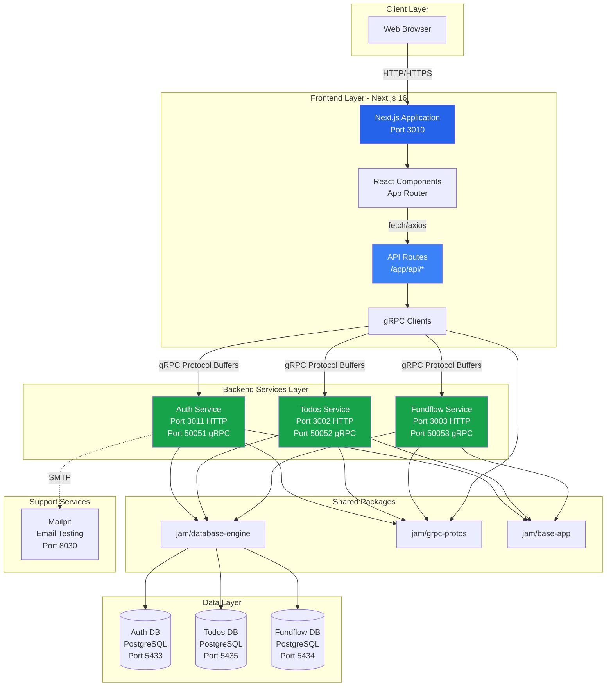
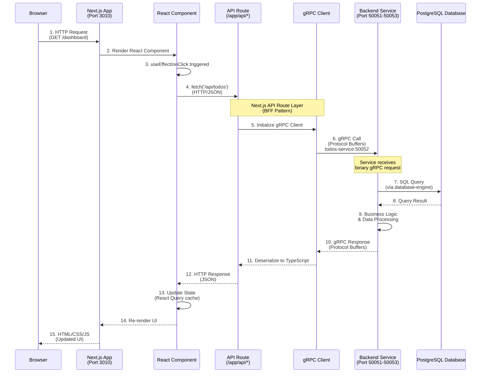
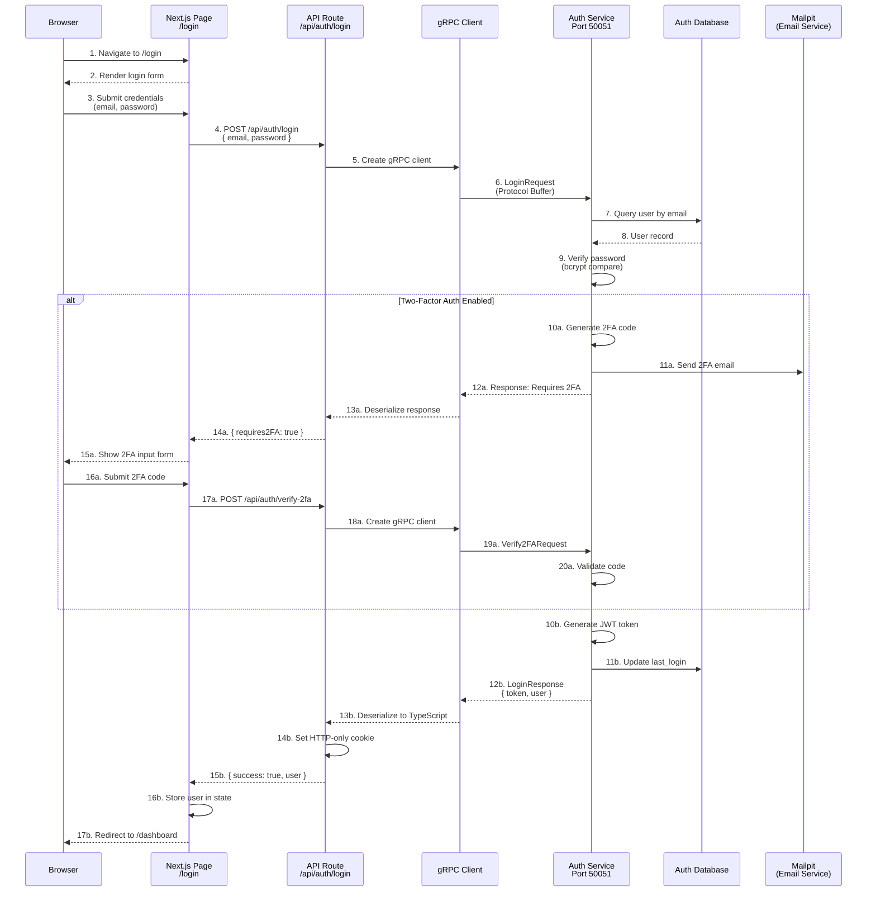
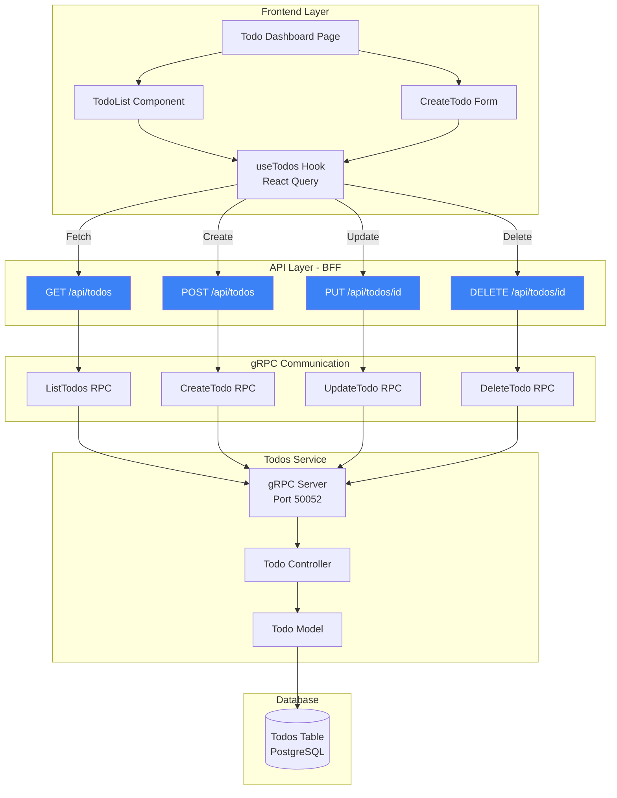
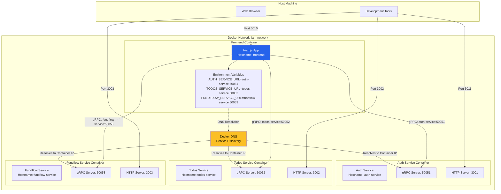

# Application Workflow Documentation

This document provides visual diagrams and explanations of how the JAM stack application operates, including service communication patterns and data flow.

## Table of Contents

1. [High-Level Architecture](#high-level-architecture)
2. [Request Flow](#request-flow)
3. [Frontend to Backend Communication (BFF Pattern)](#frontend-to-backend-communication-bff-pattern)
4. [Authentication Flow](#authentication-flow)
5. [Todo Operations Flow](#todo-operations-flow)
6. [Service Discovery and Communication](#service-discovery-and-communication)

---

## High-Level Architecture

This diagram shows the complete system architecture with all components and their relationships.



**Key Points:**
- **Single Entry Point**: Browser only communicates with Next.js frontend (port 3010)
- **BFF Pattern**: Next.js API Routes act as Backend for Frontend, translating HTTP to gRPC
- **Service Isolation**: Each microservice has its own database (database-per-service pattern)
- **Shared Code**: Monorepo packages provide common functionality across all services

---

## Request Flow

This diagram illustrates the complete journey of a typical request through the system.



**Flow Breakdown:**

1. **Browser Request**: User navigates to `/dashboard` or clicks a button
2. **Next.js Routing**: App Router serves the requested page
3. **Component Mount**: React component executes data fetching logic
4. **API Call**: Component calls Next.js API Route via fetch/axios (HTTP/JSON)
5. **gRPC Client Init**: API Route creates/reuses gRPC client connection
6. **gRPC Communication**: API Route sends binary gRPC request to backend service
7. **Database Query**: Service queries PostgreSQL via database-engine abstraction
8. **Data Retrieval**: Database returns query results
9. **Business Logic**: Service processes data, applies validation/transformation
10. **gRPC Response**: Service sends binary response back
11. **Deserialization**: gRPC client converts binary to TypeScript objects
12. **HTTP Response**: API Route sends JSON response to frontend
13. **State Update**: React Query updates cache and component state
14. **UI Re-render**: React re-renders with new data
15. **Browser Update**: User sees updated interface

---

## Frontend to Backend Communication (BFF Pattern)

This diagram demonstrates how the Frontend communicates with Backend Services through the BFF (Backend for Frontend) pattern.

```mermaid
graph LR
    subgraph "Browser"
        UserAction[User Action<br/>Click/Submit]
    end

    subgraph "Next.js Frontend (Port 3010)"
        Component[React Component<br/>TodoList.tsx]
        Hook[React Query Hook<br/>useTodos]
        APIClient[API Client<br/>src/lib/api/todos.ts]
    end

    subgraph "Next.js API Routes (BFF Layer)"
        APIEndpoint[API Endpoint<br/>/app/api/todos/route.ts]
        gRPCClientSetup[gRPC Client Setup<br/>jam/grpc-protos]
        RequestMapping[Map HTTP to gRPC]
        ResponseMapping[Map gRPC to HTTP]
    end

    subgraph "Backend Service"
        gRPCServer[gRPC Server<br/>todos-service:50052]
        ServiceLogic[Service Implementation<br/>src/grpc/todos.grpc.ts]
    end

    UserAction --> Component
    Component --> Hook
    Hook --> APIClient
    APIClient -->|fetch/axios<br/>HTTP POST<br/>JSON payload| APIEndpoint

    APIEndpoint --> gRPCClientSetup
    gRPCClientSetup --> RequestMapping
    RequestMapping -->|gRPC Call<br/>Binary Protocol Buffers| gRPCServer

    gRPCServer --> ServiceLogic
    ServiceLogic -->|gRPC Response<br/>Binary| ResponseMapping

    ResponseMapping --> APIEndpoint
    APIEndpoint -->|HTTP Response<br/>JSON| APIClient
    APIClient --> Hook
    Hook --> Component

    style APIEndpoint fill:#3b82f6,color:#fff
    style RequestMapping fill:#60a5fa,color:#000
    style ResponseMapping fill:#60a5fa,color:#000
```



**Communication Layers Explained:**

### Layer 1: Browser → Frontend Component
- **Protocol**: JavaScript function calls
- **Data Format**: TypeScript objects
- **Example**: User clicks "Create Todo" button

### Layer 2: Component → API Client
- **Protocol**: TypeScript function calls
- **Data Format**: TypeScript interfaces
- **Example**:
  ```typescript
  const { mutate } = useTodos();
  mutate({ title: 'New Todo', description: '...' });
  ```

### Layer 3: API Client → API Route (BFF)
- **Protocol**: HTTP/HTTPS
- **Method**: POST, GET, PUT, DELETE
- **Data Format**: JSON
- **Example**:
  ```typescript
  fetch('/api/todos', {
    method: 'POST',
    headers: { 'Content-Type': 'application/json' },
    body: JSON.stringify({ title: 'New Todo' })
  });
  ```

### Layer 4: API Route → Backend Service (gRPC)
- **Protocol**: gRPC (HTTP/2 with Protocol Buffers)
- **Data Format**: Binary Protocol Buffers
- **Type Safety**: Fully typed via generated TypeScript from .proto files
- **Example**:
  ```typescript
  const client = new TodosServiceClient('todos-service:50052');
  const response = await client.createTodo({
    title: 'New Todo',
    description: '...'
  });
  ```

**Why This Architecture?**

1. **Next.js as BFF provides**:
   - Single HTTP endpoint for browser (no CORS issues)
   - Server-side gRPC client management
   - Request/response transformation
   - Centralized authentication/authorization
   - Type safety end-to-end

2. **Separation of Concerns**:
   - Frontend focuses on UI/UX
   - API Routes handle protocol translation
   - Backend services focus on business logic

3. **Performance**:
   - Browser uses familiar HTTP/JSON (optimized for web)
   - Internal services use gRPC (7-10x faster than JSON)

---

## Authentication Flow

This diagram shows how authentication works across the system.



**Authentication Components:**

1. **Login Form** (`frontend/app/(auth)/login`):
   - Captures user credentials
   - Submits to Next.js API Route

2. **API Route** (`frontend/app/api/auth/login/route.ts`):
   - Receives HTTP request
   - Calls Auth Service via gRPC
   - Sets secure HTTP-only cookies
   - Returns user data

3. **Auth Service** (`services/auth-service`):
   - Validates credentials
   - Manages 2FA flow
   - Generates JWT tokens
   - Handles password hashing

4. **Database** (PostgreSQL):
   - Stores user records
   - Tracks login history
   - Manages 2FA settings

---

## Todo Operations Flow

This diagram illustrates CRUD operations for the Todos feature.



**Operation Examples:**

### 1. Fetch Todos (Read)
```typescript
// Frontend Component
const { data: todos } = useTodos();

// API Route (/app/api/todos/route.ts)
export async function GET(request: Request) {
  const client = new TodosServiceClient('todos-service:50052');
  const response = await client.listTodos({ userId: getCurrentUserId() });
  return Response.json(response.todos);
}

// Backend Service (services/todos-service/src/grpc/todos.grpc.ts)
async listTodos(call, callback) {
  const todos = await db.table('todos')
    .where('user_id', call.request.userId)
    .select('*');
  callback(null, { todos });
}
```

### 2. Create Todo (Create)
```typescript
// Frontend Component
const { mutate: createTodo } = useCreateTodo();
createTodo({ title: 'New Task', description: 'Details...' });

// API Route
export async function POST(request: Request) {
  const body = await request.json();
  const client = new TodosServiceClient('todos-service:50052');
  const response = await client.createTodo({
    title: body.title,
    description: body.description,
    userId: getCurrentUserId()
  });
  return Response.json(response.todo);
}

// Backend Service
async createTodo(call, callback) {
  const todo = await db.table('todos').insert({
    title: call.request.title,
    description: call.request.description,
    user_id: call.request.userId,
    created_at: new Date()
  });
  callback(null, { todo });
}
```

---

## Service Discovery and Communication

This diagram shows how services discover and communicate with each other within the Docker network.



**Service Discovery Process:**

1. **Docker Network**: All containers run in `jam-network` bridge network
2. **DNS Resolution**: Docker provides built-in DNS server
3. **Service Hostnames**: Each container is accessible via its service name
   - `auth-service` resolves to Auth Service container IP
   - `todos-service` resolves to Todos Service container IP
   - `fundflow-service` resolves to Fundflow Service container IP
4. **Environment Variables**: Frontend uses env vars to locate services
5. **Internal Communication**: Services communicate using container hostnames
6. **External Access**: Host machine maps specific ports for debugging

**Port Mapping Strategy:**

| Service | Internal gRPC | External gRPC | Internal HTTP | External HTTP | Purpose |
|---------|--------------|---------------|---------------|---------------|---------|
| Auth | 50051 | 50051 | 3001 | 3011 | gRPC: production, HTTP: debugging |
| Todos | 50052 | 50052 | 3002 | 3002 | gRPC: production, HTTP: debugging |
| Fundflow | 50053 | 50053 | 3003 | 3003 | gRPC: production, HTTP: debugging |
| Frontend | N/A | N/A | 3000 | 3010 | Main application access |

**Key Points:**
- **Production Traffic**: All inter-service communication uses gRPC (ports 50051-50053)
- **Debugging**: HTTP endpoints (ports 3001-3003) exposed for health checks
- **Single Entry**: Browser only accesses frontend (port 3010)
- **Service Isolation**: Each service runs in its own container with independent scaling

---

## Summary

### Communication Patterns

1. **Browser ↔ Frontend**: Traditional HTTP/HTTPS with JSON
2. **Frontend ↔ API Routes**: Internal Next.js routing (same process)
3. **API Routes ↔ Backend**: gRPC with Protocol Buffers (binary, fast)
4. **Backend ↔ Database**: SQL via database-engine abstraction

### Key Architectural Decisions

1. **BFF Pattern**: Next.js API Routes provide clean separation and type safety
2. **gRPC Internal**: 7-10x performance gain for service-to-service communication
3. **Database-Per-Service**: Independent scaling and failure isolation
4. **Monorepo**: Shared code via npm workspaces reduces duplication
5. **Docker DNS**: Automatic service discovery without additional infrastructure

### Data Flow Summary

```
User Input → React Component → React Query Hook → API Client Function
    ↓
Next.js API Route → gRPC Client → Protocol Buffer Serialization
    ↓
Backend Service gRPC Server → Service Logic → Database Query
    ↓
Database Response → Service Logic → Protocol Buffer Response
    ↓
gRPC Client Deserialization → Next.js API Route → JSON Response
    ↓
React Query Cache Update → Component Re-render → UI Update
```

This architecture provides a scalable, type-safe, and performant foundation for the JAM stack application.
